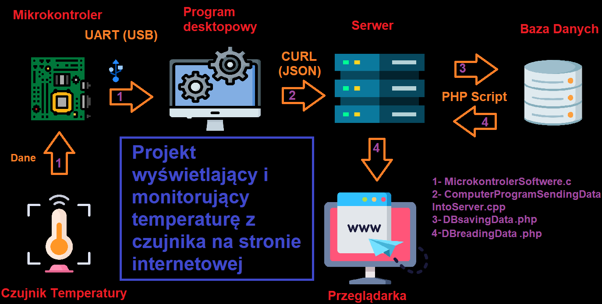

# TemperatureSensor
1. Temperature sensor on board send data through microcontroller programmed in C-embedded to PC    2. Program writed in C++ send data using CURL to PHP domain script where is saved into DataBase. 3. Another PHP script is reading data from DB and display them on the website

